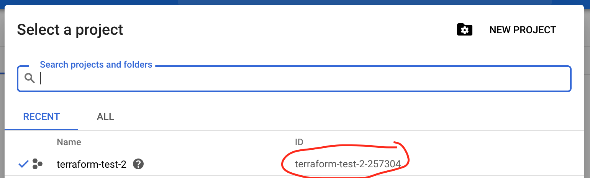
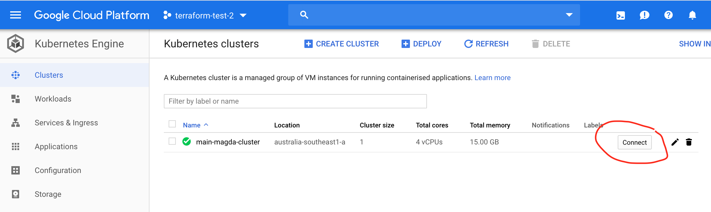

# Magda Config

This is a simple boilerplate that allows you to quickly set up a Magda instance - the idea is that you can fork this config, commit changes but keep merging in master in order to stay up to date.

## ⚠️ Warning: Compatibility Issues  ⚠️

We have upgraded our Terraform module to work with Magda v0.0.57 or later (using Helm3 Terraform Provier).

If you need the Terraform module to deploy an older version Magda (v0.0.56-RC or earlier), please check out branch [v0.0.56-RC6](https://github.com/magda-io/magda-config/tree/v0.0.56-RC6) and use Terraform module there.

## ⚠️ Warning: Work in Progress ⚠️
With this repo we're trying to make it as easy to get started with Magda as possible... but we're not there yet. To setup Magda in a similar configuration to [data.gov.au](https://data.gov.au) (i.e. an openly-available, pure-open-data search engine) is _fairly_ simple, but using other features (e.g. Add Dataset, the Admin UI) will almost certainly result in getting stuck in some way that requires Kubernetes skills to get out of.

This doesn't mean you shouldn't try, and we're happy to answer any questions you have on our [Spectrum Forum](https://spectrum.chat/magda). Just be aware that at best, this repo works a bit like a Linux installer - it can get you started easily, but if you want to mess around you'll still have to learn how it works.

## Getting Started
How you get started with Magda will depend on where you're starting from:
- **I have nothing already set up, and I'm happy to run everything on Google Cloud through Terraform**: Please use the instructions below.
- **I already have a kubernetes cluster, or want to use a local environment/cloud environment other than Google Cloud, or I just don't like Terraform**: Please use the guide at [existing-k8s.md](./existing-k8s.md). Note that this is a bit harder than just letting terraform do the heavy lifting for you, but you'll also learn more along the way.

> NOTE: Since version `v0.0.57`, Magda requires Helm v3 to deploy. The Terraform helm provider has been upgraded to version 1.1.1 to support Helm v3. If you previously deployed an older version (e.g. v0.0.56-RC6) Magda, please refer to [this migration document](https://github.com/magda-io/magda/blob/8979f9e2322c2d94b0c0dcc893f190680667fa35/docs/docs/migration/v0.0.56-RC6-to-v0.0.57-0.md) to upgrade your release before use terraform to upgrade your existing release to a newer version. 

## Quickstart Instructions - Terraform

For new users setting up Magda for the first time we recommend using these instructions - these use [Terraform](https://www.terraform.io/intro/index.html) to set you up with a instance running on Google Cloud Engine very quickly (about 5 minutes of entering commands / editing config and 20 minutes of waiting), and gives you a basic instance, and in another 30-60 minutes of waiting will get you HTTPS working on your own domain.

### 1. Clone this repo

```bash
git clone --single-branch --branch master https://github.com/magda-io/magda-config.git
```

or download it with the "Clone or download" button in Github.

### 2. Install Terraform

Go to [https://learn.hashicorp.com/terraform/getting-started/install.html](https://learn.hashicorp.com/terraform/getting-started/install.html) for instructions

### 3. Install Helm

Go to [https://helm.sh/docs/intro/install/](https://helm.sh/docs/intro/install/) for instructions

Version 3.2.0 or higher is required.

You can test your install by:

```bash
helm version
```

this should tell you the version of the helm installed.

### 4. Install [Google Cloud SDK](https://cloud.google.com/sdk/docs/downloads-interactive)

Go to [https://cloud.google.com/sdk/docs/downloads-interactive](https://cloud.google.com/sdk/docs/downloads-interactive) for instructions.

Once `Google Cloud SDK` is installed, you also need to install gcloud beta components by the following command:

```bash
gcloud components install beta
```

### 5. Create a Google Cloud Project

Before you start the deployment process, you need to create a [google cloud project](https://cloud.google.com/resource-manager/docs/creating-managing-projects) via [Google Cloud Console](https://console.cloud.google.com/) and note down the `Project Id`. Note that this isn't necessarily exactly the same as the id you specified - if it's already been taken, Google will append some numbers to it. Make sure by checking the "Select a Project" dialog in Google Cloud:



### 6. Set Default Project

Set the project id you noted down to an environment variable, because you'll need it in a few places - this will work in bash. If you're using another shell use the equivalent command or just manually replace `$PROJECT_ID` with your project id.

```bash
export PROJECT_ID=[your-project-id]
```

Then set it as the default in Google Cloud

```bash
gcloud config set project $PROJECT_ID
```

#### 7. Enable required services & APIs for your project

```bash
gcloud services enable compute.googleapis.com
gcloud services enable container.googleapis.com
```

#### 8. Create service account for the deployment

```bash
gcloud iam service-accounts create magda-robot
```

Feel free to use a name other than `magda-robot` if you like.

#### 9. Find out service account email

You need to find out the service account email of your newly created service account to be used as the identifier in other commands.

To do so, first list all service accounts:

```bash
gcloud iam service-accounts list
```

Find the row of your service account. The service account email should be something similar to `magda-robot@[your-project-id].iam.gserviceaccount.com`. You'll need this a few times, so it's worth saving it to an environment variable - once again, if you're not using a shell that supports this you can just manually replace $SERVICE_ACCOUNT_EMAIL with the email address itself.

```bash
export SERVICE_ACCOUNT_EMAIL=[your-service-account-email]
```

#### 10. Create an access key for your service account

First go to the `terraform/magda` directory inside your cloned version of this repository.

```bash
cd magda-config/terraform/magda
```

```bash
gcloud iam service-accounts keys create key.json --iam-account=$SERVICE_ACCOUNT_EMAIL
```

You will now have a `key.json` file in `terraform/magda`, containing a private key. We suggest you put this somewhere safe like a password manager.
DO **NOT** CHECK IT INTO SOURCE CONTROL.

#### 11. Grant service account permission

Grant `editor` role to your service account:

```bash
gcloud projects add-iam-policy-binding $PROJECT_ID --member serviceAccount:$SERVICE_ACCOUNT_EMAIL --role roles/editor
```

Grant `k8s admin` role to your service account:

```bash
gcloud projects add-iam-policy-binding $PROJECT_ID --member serviceAccount:$SERVICE_ACCOUNT_EMAIL --role roles/container.admin
```

#### 12. Initiate Terraform

To do so, run:

```bash
terraform init
```

After a bit of waiting you should get this message:

```console
Terraform has been successfully initialized!

You may now begin working with Terraform. Try running "terraform plan" to see
any changes that are required for your infrastructure. All Terraform commands
should now work.

If you ever set or change modules or backend configuration for Terraform,
rerun this command to reinitialize your working directory. If you forget, other
commands will detect it and remind you to do so if necessary.
```

#### 13. Edit terraform config

Edit `terraform/magda/terraform.tfvars` and supply the follow parameters:

- `Project id`: the id of the google cloud project that you created (`echo $PROJECT_ID`)
- `Deploy Region`: which region you want to deploy magda to
- `credential_file_path`: the path of the service account key file (`key.json`) that we just generated
- `namespace`: which kubernetes namespace you want to deploy Magda to (generally this should just be "default")
- `external_domain`: Optional: what domain you want the Magda server to be accessed from (which requires a bit of extra configuration). Leave blank to just access your instance through a temporary domain. You can set this later if necessary.

Other optional settings and their default values (if not set) are:

- `cluster_node_pool_machine_type`: The machine type to use, see [https://cloud.google.com/compute/vm-instance-pricing](https://cloud.google.com/compute/vm-instance-pricing) for more details. Default: `n1-standard-4`
- `kubernetes_dashboard`: Whether turn on [kubernetes_dashboard](https://github.com/kubernetes/dashboard) or not; Default: `false`

You can find full list of configurable options from [here](./terraform/magda/variables.tf).

#### 14. Edit default helm config

Look at [values.yaml](./chart/values.yaml). It has reasonable defaults but you might want to edit something - it will give you a new instance with a standard colour scheme/logos and no datasets (yet).

#### 15. Deploy!

```bash
terraform apply -auto-approve
```

This will take quite a while (like 20 minutes), but it should update you about its progress. Take this opportunity to make a cup of tea or stretch!

Once the deployment is complete, you should get a bunch of output including something like this:

```console
Apply complete! Resources: 12 added, 0 changed, 0 destroyed.

Outputs:

external_access_url = http://34.98.120.7.xip.io/
external_ip = 34.98.120.7
```

You should be able to go to `http://[external_ip]` right away and see your Magda homepage come up. If you didn't specify `external_domain`, then the `external_access_url` will also work, otherwise see below:

##### Use Your Own Domain

If you specified `external_domain`, you need to create a DNS `A` record in your DNS registrar's system. The `A` record needs to point to the `external_ip` that was generated when deploying Magda.

##### SSL / HTTPS Access

As long as you specified `external_domain` in config file `terraform/magda/terraform.tfvars` and you've set an `A` record from that domain to the value that came back from `external_ip`, the SSL certificate will be automatically generated and set up for you. The process is going to take 30 to 60 minutes as [specified by Google](https://cloud.google.com/load-balancing/docs/ssl-certificates):
> With a correct configuration the total time for provisioning certificates is likely to take from 30 to 60 minutes.

##### Upgrade Your Site for SSL / HTTPS Access

If you didn't supply a value for `external_domain` config field during your initial deployment, you can edit the config file and update your deployment by re-running:

```bash
terraform apply -auto-approve
```

#### 16. What now?

Start playing around!

- If you want to get some datasets into your system, turn the `connectors` tag to `true` in [values.yaml](./chart/values.yaml) and re-run `terraform apply -auto-approve`. A connector job will be created and start pulling datasets from `data.gov.au`... or you can modify `connectors:` in [values.yaml](./chart/values.yaml) to pull in datasets from somewhere else.
- In the Google Cloud console, go to Kubernetes Engine / Clusters and click the "Connect" button, then use the `kubectl` command (should be installed along with the Google Cloud command line) to look at your new Magda cluster.



Use `kubectl get pods` to see all of the running containers and `kubectl logs -f <container name>` to tail the logs of one. You can also use `kubectl port-forward combined-db-0 5432` to open a tunnel to the database, and use psql, PgAdmin or equivalent to investigate the database - you can find the password in terraform.tfstate.

- Sign up for an API key on Facebook or Google, and put your client secret in terraform.tfvars and your client id in [values.yaml](./chart/values.yaml) to enable signing in via OAuth.
- Configure an SMTP server in terraform.tfvars and [values.yaml](./chart/values.yaml) and switch the `correspondence` flag to true in order to be able to send emails from the app.
- Set `scssVars` in [values.yaml](./chart/values.yaml) to change the colours
- Ask us questions on https://spectrum.chat/magda
- Send us an email at contact@magda.io to tell us about your new Magda server.

## FAQ
### How do I make myself an admin?
This is harder than it should be at this point.
1. Use `kubectl port-forward combined-db-0 5432 -n <your-namespace>` to get a connection to the database
2. Get your db password out of the `db-passwords` secret - in bash you can use 
```bash
kubectl get secrets db-passwords -o yaml -n <your namespace> | grep authorization-db: | awk '{print $2}' | base64 -D
```
or you can just use `kubectl get secrets db-passwords -o yaml -n <your namespace>` to get the secret then base64 decode it to get the password.
3. Use [acs-cmd](https://www.npmjs.com/package/@magda/acs-cmd) to set / unset a user as an admin

### Where's the admin UI?

After login as an Admin user, you will see the `Admin` button on your account details page.

### How do I authorise API access?
Please refer to [How to create API key](https://github.com/magda-io/magda/blob/master/docs/docs/how-to-create-api-key.md) doc for more information of accessing APIs with an API key.
### How do I add a new dataset
After login as an admin user, you will see a button for creating a new dataset on `Home Page`.

## Troubleshooting
- If something goes wrong, often you can fix it by just running `terraform apply` again.
- If that fails, and you've got up to the `helm release` stage, you can try deleting the helm release by running:

```bash
terraform taint helm_release.magda_helm_release
terraform taint kubernetes_secret.auth_secrets
terraform taint kubernetes_secret.db_passwords
terraform taint kubernetes_namespace.magda_namespace
terraform taint kubernetes_namespace.magda_openfaas_namespace
terraform taint kubernetes_namespace.magda_openfaas_fn_namespace
```

And then `terraform apply` again. Note that this will probably destroy any data you've entered so far.
- If _that_ fails, you can start the entire process from scratch by running `terraform destroy` and re-running `terraform apply`. This will definitely destroy any data you've entered so far.